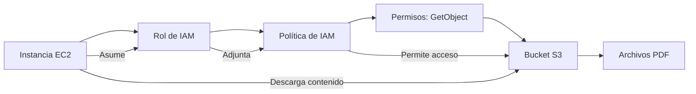

## Roles de IAM

Es el servicio de entidad para los recursos propios de AWS. Algunos de servicios de AWS pueden intereactuar contra la propia API de AWS. Para ello se determinan roles de IAM, entidades qué determinan que acciones pueden realizarse. A dichos roles se les puede asignar políticas de IAM para definir el alcance de sus acciones.

Los roles suelen usarse frecuentemente con

- Instancias EC2
- Funciones Lambda
- Tareas de ECS
